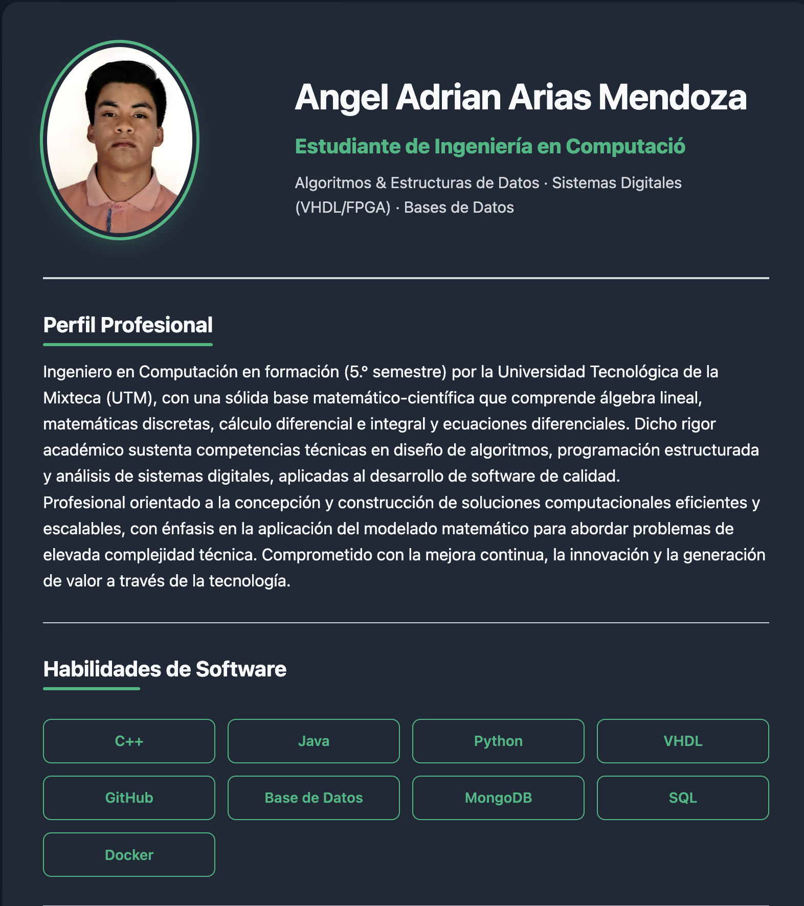
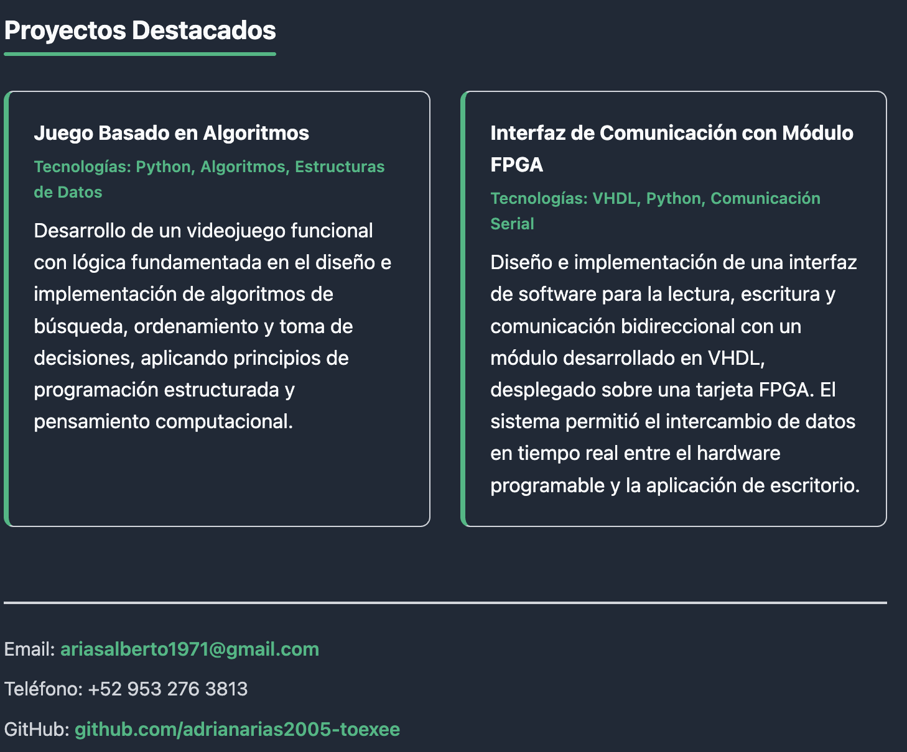

# Curriculum Vitae — Angel Adrian Arias Mendoza

Currículum Vitae personal desarrollado con HTML y CSS puro, desplegado como sitio web estático en GitHub Pages.


---

## Vista previa




---

## Ver en línea

[adrianarias2005-toexee.github.io/Curriculum-Vitae](https://adrianarias2005-toexee.github.io/Curriculum-Vitae/)

---

## Características

- Diseño responsivo adaptado para escritorio
- Paleta de colores minimalista
- Tipografía limpia y legible
- Sin dependencias externas — solo HTML y CSS

---

## Contenido del CV

- **Perfil profesional** — presentación y objetivo
- **Habilidades técnicas** — C++, Java, Python, VHDL, Docker, MongoDB, SQL
- **Proyectos destacados** — trabajos académicos y personales
- **Información de contacto** — correo y redes

---

## Tecnologías

| Tecnología | Uso |
|-----------|-----|
| HTML5 | Estructura y semántica |
| CSS3 | Estilos, layout y paleta de colores |


---

## Estructura del proyecto

```
CV-Adrian/
├── index.html        # Página principal del CV
├── css/              # Hojas de estilo
└── Imagenes/         # Capturas de pantalla y recursos visuales
```

---

## Autor

**Angel Adrian Arias Mendoza**  
Estudiante de Ingeniería en Computación — Universidad Tecnológica de la Mixteca (UTM)  
[ariasalberto1971@gmail.com](mailto:ariasalberto1971@gmail.com)
